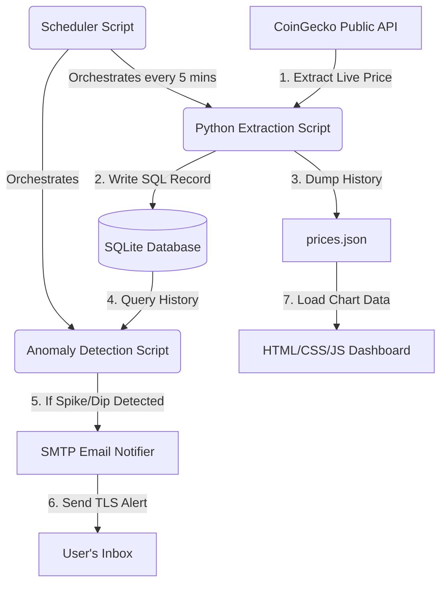

# Crypto Price Tracker & Anomaly Detection Pipeline

An automated, lightweight, end-to-end data engineering pipeline that extracts live cryptocurrency market data, performs moving-average anomaly detection, stores transaction histories, dispatches email alerts, and visualizes price trends on an interactive web dashboard.

---

## 🛠️ Tech Stack & Tools
* **Programming Language:** Python 3.10+ (Core ingestion, database handling, logic, orchestration)
* **Database / Storage:** SQLite (Relational database storing price logs)
* **Data Processing:** Pure Python (Simple Moving Average calculations, anomaly screening)
* **Orchestration:** `schedule` (Automated cron-like polling scheduler)
* **Alerting System:** SMTP via Python `smtplib` (Secure SSL/TLS email dispatch)
* **Web UI Dashboard:** HTML5, CSS3 (Glassmorphism design), JavaScript (ES6), Chart.js (CDN-served charts)
* **Configuration:** `python-dotenv` (Secure local secret and credential handling)

---

## 📐 Pipeline Architecture & Data Flow



1. **Extraction (Ingestion):** The pipeline requests USD prices for Bitcoin, Ethereum, and Solana from the free public CoinGecko API every 5 minutes.
2. **Transformation & Anomaly Check:** The program computes a Simple Moving Average (SMA) of the last 10 normal historical records. If the newly fetched price deviates from this average by **&ge; 2%**, it is flagged as an anomaly (`spike` or `dip`).
3. **Storage (Load):** The price and anomaly flags are committed to the SQLite database.
4. **Alerting:** If an anomaly is identified, a secure TLS connection is negotiated with Gmail's SMTP servers to dispatch a detailed email alert.
5. **Data Export:** The recent database records are compiled and exported to a flat JSON file (`prices.json`).
6. **Serving (Frontend):** A local static dashboard reads `prices.json` and renders an interactive line chart, highlighting anomaly data points as red dots.

---

## 📂 Folder Structure
```text
Crypto Tracker/
│
├── data/
│   ├── crypto_prices.db       # SQLite Database file (automatically generated)
│   └── prices.json            # Price history JSON file used by the dashboard
│
├── src/
│   ├── database.py            # SQLite schema initialization and query operations
│   ├── fetcher.py             # Ingests live prices from CoinGecko API
│   ├── detector.py            # Moving average anomaly detection algorithm
│   ├── notifier.py            # Formats and sends secure SMTP email alerts
│   └── main.py                # Pipeline entry point & scheduler orchestrator
│
├── web/
│   ├── index.html             # Dashboard layout
│   ├── style.css              # Dark theme CSS with custom animations
│   └── app.js                 # JS script to poll prices.json and render Chart.js
│
├── .env.example               # Template file for secret configurations
├── .gitignore                 # Files excluded from GitHub commits (database, secrets)
├── requirements.txt           # Python dependency file
└── README.md                  # Project documentation (this file)
```

---

## 📊 Database Schema Design (`prices` table)

| Column Name | Data Type | Key Constraints | Description |
| :--- | :--- | :--- | :--- |
| `id` | INTEGER | PRIMARY KEY AUTOINCREMENT | Unique identifier for each price event |
| `timestamp` | TEXT | NOT NULL | UTC DateTime stamp of record (`YYYY-MM-DD HH:MM:SS`) |
| `coin_id` | TEXT | NOT NULL | API coin identifier (e.g. `bitcoin`, `ethereum`) |
| `coin_symbol` | TEXT | NOT NULL | Uppercase ticker symbol (e.g. `BTC`, `ETH`) |
| `price_usd` | REAL | NOT NULL | Price in USD (floating-point representation) |
| `is_anomaly` | INTEGER | DEFAULT 0 | Flag indicating anomaly status (0 = Normal, 1 = Anomaly) |
| `anomaly_type` | TEXT | DEFAULT NULL | Description of anomaly category (`spike`, `dip`, or `NULL`) |

---

## 🚀 Getting Started

### 1. Prerequisites & Installation
Clone the repository, enter the folder, and set up your Python environment:
```powershell
# Create a virtual environment
python -m venv venv

# Activate the virtual environment (Windows)
.\venv\Scripts\Activate.ps1

# Install requirements
pip install -r requirements.txt
```

### 2. Configure Email Settings (Optional)
To enable email notifications, configure your environment variables:
1. Copy the example configuration template:
   ```powershell
   Copy-Item .env.example .env
   ```
2. Open `.env` and fill in your details:
   * **`ENABLE_EMAIL`**: Change to `True`.
   * **`SENDER_EMAIL`** and **`RECEIVER_EMAIL`**: Put your Gmail address.
   * **`SENDER_PASSWORD`**: Put your **16-digit Google App Password** (Generated in Google Account settings > Security > 2-Step Verification > App Passwords).

*Note: If `ENABLE_EMAIL` is set to `False` (default), the pipeline will log anomalies to the console instead without failing.*

---

## 🏃 Running the Application

### 1. Start the Data Pipeline
Run the main orchestrator script:
```powershell
python src/main.py
```
* **Immediate execution:** The pipeline runs one complete execution cycle immediately on boot to gather initial data.
* **Scheduling:** It then schedules itself to run automatically every 5 minutes. Leave the terminal window open to keep the pipeline running.

### 2. Launch the Web Dashboard
Due to browser CORS security policies, you cannot open `index.html` directly from your file manager. Serve it using Python's built-in web server:
```powershell
# Open a separate terminal window and run:
python -m http.server 8000 --directory web
```
Navigate to **[http://localhost:8000](http://localhost:8000)** in your web browser. The dashboard automatically polls for new data every 30 seconds.

---

## 💡 Key Engineering Principles Implemented

* **Decoupled Architecture:** Follows the Single Responsibility Principle. The fetcher only extracts, the database layer only saves, the detector only analyzes, and the main script coordinates.
* **Preventing Baseline Poisoning:** When calculating the simple moving average baseline, the detector filters out past anomalies (`is_anomaly = 0`). This ensures that extreme price spikes or dips do not distort the average, preserving the sensitivity of the algorithm.
* **API Rate-Limit Tolerance:** Free APIs are subject to limits. The fetcher includes custom headers (User-Agent) and handles HTTP 429 errors gracefully without throwing stack traces.
* **Security & Secret Isolation:** The project utilizes `.env` files for SMTP credentials. The `.gitignore` file is strictly set up to prevent database binaries, environment folders, and secret config files from being committed to source control.
* **Performance Optimization:** The scheduler infinite loop runs a `time.sleep(1)` check. This keeps the thread sleeping 99% of the time, reducing CPU core usage to 0% while remaining highly responsive.
